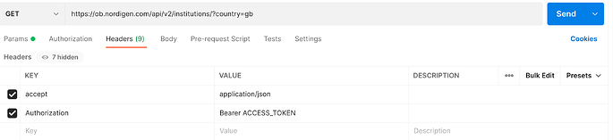

# Rundurance — Instrucciones del Equipo

> 5 desarrolladores junior · Plazo de 2 semanas · MPA · Vanilla JS + Node.js + PostgreSQL + N8N

---

## Tabla de Contenidos

1. [Arquitectura — Cómo está organizado el código](#1-arquitectura--cómo-está-organizado-el-código)
2. [Cómo fluye una petición por la app](#2-cómo-fluye-una-petición-por-la-app)
3. [Flujo de Trabajo con Git](#3-flujo-de-trabajo-con-git)
4. [Alcance del MVP — Qué construir y cuándo](#4-alcance-del-mvp--qué-construir-y-cuándo)
5. [Convenciones de Código](#5-convenciones-de-código)
6. [Variables de Entorno](#6-variables-de-entorno)
7. [Rutina Diaria](#7-rutina-diaria)
8. [Errores Comunes a Evitar](#8-errores-comunes-a-evitar)
9. [Referencia Rápida — Comandos Útiles](#9-referencia-rápida--comandos-útiles)

---

## 1. Arquitectura — Cómo está organizado el código

Usamos un **backend de tres capas**:

```
routes/      ← recibe la petición HTTP, valida el input, llama al controlador
controllers/ ← orquesta: llama a servicios + modelos, envía la respuesta
models/      ← contiene solo consultas SQL
middleware/  ← verificación JWT (un archivo, ya escrito — no lo modifiques)
db/          ← conexión a la base de datos (un archivo, ya escrito — no lo modifiques)
services/    ← S3, parser de FIT, n8n — utilidades aisladas, ya escritas
```

### Estructura visual

```
server.js                            ← inicia la app, registra todas las rutas
schema.sql                           ← esquema PostgreSQL completo (ya aplicado a la BD)
src/
  routes/
    auth.js                          ✅ POST /api/auth/register, POST /api/auth/login
    athletes.js                      ⏳ GET/POST/PUT/DELETE /api/athletes
    finances.js                      ⏳ GET /api/finances, GET /api/finances/summary
    workouts.js                      ✅ POST /api/workouts/upload, GET /api/workouts/athlete/:id
  controllers/
    authController.js                ✅ register, login
    athleteController.js             ⏳ findAll, findById, create, update, remove
    financeController.js             ⏳ findAll, getSummary, update
    workoutController.js             ✅ upload, saveFeedback, getByAthlete
  models/
    userModel.js                     ✅ findByEmail, createTrainer
    athleteModel.js                  ⏳ findAll, findById, create, update, remove
    financeModel.js                  ⏳ findAll, getSummary, update
    workoutModel.js                  ✅ insertCompletedWorkout, insertLaps, insertFeedback, getCompletedWorkoutsByAthlete
  middleware/
    auth.js                          ✅ lee el JWT del header, rechaza si es inválido
  db/
    connection.js                    ✅ pool de PostgreSQL (importado por cada modelo)
  services/
    s3.js                            ✅ subir / obtener URLs presignadas de S3 (bucket: rundurance, región: us-east-2)
    fitParser.js                     ✅ parsear archivos .FIT de Garmin + COROS (soporta gzip)
    n8n.js                           ✅ construye el payload compacto y dispara el webhook de n8n
public/
  index.html                         ← página de inicio
  login.html                         ← formulario de login
  athlete.html                       ← dashboard del entrenador: atletas
  finance.html                       ← dashboard del entrenador: finanzas
  assets/
    js/                              ← un archivo JS por página HTML (llamadas fetch a la API)
    css/                             ← estilos personalizados más allá de Tailwind
    images/                          ← logo, fotos de atletas
```

---

## 2. Cómo fluye una petición por la app

Entender este flujo es lo más importante. Cada funcionalidad sigue el mismo patrón.

```
Navegador (fetch)
   │
   ▼
server.js                      ← enruta la URL al router correcto
   │
   ▼
src/routes/athletes.js         ← aplica middleware de auth, pasa req al controlador
   │
   ▼
src/controllers/athleteController.js  ← valida, llama al modelo, envía la respuesta
   │
   ▼
src/models/athleteModel.js     ← ejecuta la consulta SQL contra PostgreSQL
   │
   ▼
src/db/connection.js           ← el pg Pool ejecuta la consulta
   │
   ▼
(la respuesta sube de vuelta y res.json() la envía al navegador)
```

### Ejemplo concreto — GET /api/athletes

```js
// src/routes/athletes.js
router.get("/", auth, controller.findAll);
```

```js
// src/controllers/athleteController.js
async function findAll(req, res) {
  try {
    const athletes = await athleteModel.findAll(req.trainer.trainer_id);
    res.json(athletes);
  } catch (err) {
    console.error(err);
    res.status(500).json({ error: "Error al obtener atletas" });
  }
}
```

```js
// src/models/athleteModel.js
async function findAll(trainerId) {
  const { rows } = await db.query(
    "SELECT * FROM athlete WHERE trainer_id = $1 ORDER BY last_name",
    [trainerId],
  );
  return rows;
}
```

```js
// public/assets/js/athlete.js  (lado del navegador)
const res = await fetch("/api/athletes", {
  headers: { Authorization: `Bearer ${localStorage.getItem("token")}` },
});
const athletes = await res.json();
```

### El flujo de subida de sesión (ya implementado — solo referencia)

```
Navegador sube archivo .FIT (multipart)
   │
   ▼
POST /api/workouts/upload (requiere auth)
   │
   ▼
workoutController.upload
   ├── fitParser.parseFit(buffer)       → { summary, laps }   (Garmin + COROS + .gz)
   ├── s3.uploadFitFile(buffer, ...)    → s3_key
   ├── workoutModel.findPlannedWorkoutByDate(...)
   ├── workoutModel.insertCompletedWorkout(...)
   ├── workoutModel.insertLaps(...)
   └── n8n.triggerFeedback(...)         → webhook fire-and-forget
   │
   ▼
201 { completed_workout_id, laps_saved, matched_plan }
```

```
Flujo n8n (por configurar):
   Webhook trigger → Agente IA (Claude) → POST /api/workouts/:id/feedback
```

---

## 3. Flujo de Trabajo con Git

Mantenlo simple. Tres reglas:

### Regla 1 — Nunca hacer push directamente a `main`

`main` siempre debe contener código funcionando. Todos trabajan en su propia rama.

### Regla 2 — Una rama por funcionalidad

```bash
git checkout -b feature/auth
git checkout -b feature/athletes
git checkout -b feature/finances_example_snake_case
git checkout -b feature/workout_ui
```

Nomenclatura de ramas: siempre `feature/` + nombre de la funcionalidad en minúsculas, sin espacios y si hay espacio se dividide con\_ .

### Regla 3 — Abrir un Pull Request para hacer merge

Cuando tu funcionalidad esté lista:

1. Push de tu rama: `git push origin feature/athletes`
2. Ve a GitHub → abre un Pull Request desde tu rama hacia `main`
3. Otro compañero lo revisa (una mirada rápida es suficiente)
4. Hacer merge

### Rutina diaria de Git

```bash
# Al inicio de cada sesión de trabajo — sincroniza con main primero
git checkout main
git pull origin main
git checkout feat/tu-funcionalidad
git merge main                   # trae los últimos cambios de tus compañeros

# Trabaja... luego guarda tu progreso
git add src/controllers/athleteController.js src/models/athleteModel.js
git commit -m "feat: add GET /api/athletes endpoint"
git push origin feat/athletes
```

### Formato de mensajes de commit

#### Conventional commits: https://www.conventionalcommits.org/en/v1.0.0/

```
feat: add athlete list endpoint
fix: correct SQL query in athleteModel
style: update athlete card layout
chore: add .env.example file
```

Usa uno de: `feat`, `fix`, `style`, `chore`, `refactor`. Mensajes cortos y en inglés.

### Cuando hay un conflicto de merge

No entres en pánico. Un conflicto significa que dos personas editaron las mismas líneas. Abre el archivo con conflicto — Git marca las secciones:

```
<<<<<<< HEAD
  tu código
=======
  código del compañero
>>>>>>> feat/athletes
```

Elige la versión correcta (o combina ambas), elimina los marcadores, guarda el archivo, luego:

```bash
git add el-archivo-conflictivo.js
git commit -m "fix: resolve merge conflict in athletes route"
```

---

## 4. Alcance del MVP — Qué construir y cuándo

### Ya completado ✅

| Tarea                      | Detalles                                                           |
| -------------------------- | ------------------------------------------------------------------ |
| Esquema de BD              | 11 tablas aplicadas al PostgreSQL remoto                           |
| Configuración del servidor | `server.js`, Express, archivos estáticos, todas las rutas montadas |
| Auth JWT                   | `POST /api/auth/register` y `POST /api/auth/login`                 |
| Middleware de auth         | Verificación JWT, `req.trainer` inyectado                          |
| Conexión a BD              | pg Pool singleton                                                  |
| Pipeline de subida .FIT    | Parsear → S3 → BD → webhook n8n (Garmin + COROS + gzip)            |
| Modelo de sesiones         | insert, insertLaps, insertFeedback, getByAthlete                   |
| Integración S3             | bucket `rundurance`, región `us-east-2`                            |
| Constructor de payload n8n | JSON compacto enviado al webhook en cada subida                    |

---

## 5. Convenciones de Código

El código consistente entre cinco desarrolladores requiere convenciones acordadas. Síguelas sin excepción.

### 5.1 Nombres de archivos y carpetas (todo el codigo debe ser en ingles de cara al sistema, y de cara al usuario en espaniol)

- Carpetas: `minúsculas` (ej: `routes/`, `models/`, `controllers/`) mas de dos palabras, separadas por \_ (ej: `routes_juan/`, `models_migue_luis/`, `controllers_duvan_geisler/`)
- Archivos JS: `camelCase` (ej: `athleteModel.js`, `athleteController.js`)
- Archivos HTML: `minúsculas` (ej: `athlete.html`, `finance.html`)

### 5.2 JavaScript (backend — Node.js)

```js
// ✅ Usa async/await, siempre envuelve en try/catch
async function findAll(req, res) {
  try {
    const athletes = await athleteModel.findAll(req.trainer.trainer_id);
    res.json(athletes);
  } catch (err) {
    console.error(err);
    res.status(500).json({ error: "Error interno del servidor" });
  }
}

// ❌ Nunca dejes un handler sin try/catch — un error no capturado mata el servidor
async function findAll(req, res) {
  const athletes = await athleteModel.findAll(req.trainer.trainer_id); // si esto falla, el servidor muere
  res.json(athletes);
}
```

```js
// ✅ Usa const para todo, let solo si necesitas reasignar
const athletes = await athleteModel.findAll(trainerId);

// ❌ Nunca uses var
var athletes = ...;
```

```js
// ✅ CommonJS (este proyecto usa require/module.exports — sin import/export)
module.exports = { findAll, findById, create };

// ✅ Usa require() en todas partes
const athleteModel = require("../models/athleteModel");
```

```js
// ✅ req.trainer contiene el entrenador logueado (asignado por el middleware de auth)
// Campos: trainer_id, email, role
const trainerId = req.trainer.trainer_id;
```

### 5.3 SQL (dentro de los archivos de modelo)

```js
// ✅ Siempre usa consultas parametrizadas ($1, $2...) — NUNCA concatenación de strings
const { rows } = await db.query(
  "SELECT * FROM athlete WHERE trainer_id = $1 AND athlete_id = $2",
  [trainerId, athleteId],
);

// ❌ Esto es inyección SQL — nunca lo hagas
const { rows } = await db.query(
  `SELECT * FROM athlete WHERE trainer_id = ${trainerId}`,
);
```

```js
// ✅ Siempre desestructura rows del resultado
const { rows } = await db.query("SELECT * FROM athlete WHERE athlete_id = $1", [
  id,
]);
return rows[0]; // registro único
return rows; // múltiples registros
```

### 5.4 JavaScript (frontend — navegador)

```js
// ✅ Siempre envía el token JWT en cada petición autenticada
const res = await fetch("/api/athletes", {
  headers: {
    "Content-Type": "application/json",
    Authorization: `Bearer ${localStorage.getItem("token")}`,
  },
});

// ✅ Siempre verifica el status de la respuesta antes de usar los datos
if (!res.ok) {
  const err = await res.json();
  alert("Error: " + err.error);
  return;
}
const data = await res.json();
```

```js
// ✅ Guarda el token y la info del entrenador después del login
localStorage.setItem("token", data.token);
localStorage.setItem("trainer", JSON.stringify(data.trainer));

// ✅ Redirige si no hay token (protege las páginas)
if (!localStorage.getItem("token")) {
  window.location.href = "/login.html";
}
```

### 5.5 HTML / Tailwind CSS

- Usa `slate` para colores neutros y `sky-400` como color de acento principal — mantenlo consistente en todas las páginas.
- Todo el texto visible al usuario debe estar en **español**.
- No escribas CSS personalizado para cosas que Tailwind ya puede hacer.
- Mantén cada página HTML autocontenida (su propio `<script src="...">` al final).
- Usa Bootstrap Icons via CDN para todos los iconos.

### 5.6 Mensajes de error (UI)

Siempre muestra errores en español, siempre muestra algo — nunca dejes que la UI falle silenciosamente.

```js
// ✅
alert("No se pudo cargar la lista de atletas. Intenta de nuevo.");

// ❌ Fallo silencioso — el usuario no sabe qué pasó
console.log(err);
```

---

## 6. Variables de Entorno

Nunca escribas credenciales, URLs o secretos directamente en el código. Usa un archivo `.env`.

El archivo `.env` ya existe en la raíz con valores reales. **No lo sobreescribas.** Si agregas una nueva variable, añádela a `.env.example` con un valor en blanco para que los compañeros sepan que existe.

Variables requeridas:

```
DATABASE_URL=postgres://...         # String de conexión PostgreSQL remoto
JWT_SECRET=...                      # String largo y aleatorio para firmar tokens
AWS_REGION=us-east-2                # Región S3
AWS_ACCESS_KEY_ID=...               # Credenciales AWS
AWS_SECRET_ACCESS_KEY=...           # Credenciales AWS
S3_BUCKET=rundurance                # Nombre del bucket S3
N8N_WEBHOOK_URL=                    # URL del webhook n8n (llenar cuando n8n esté configurado)
PORT=3000
```

**Reglas:**

- `.env` está en `.gitignore` — nunca debe subirse a GitHub.
- Nunca imprimas un secreto en la consola.
- Accede a las variables en el código con `process.env.NOMBRE_VARIABLE`.

---

## 7. Rutina Diaria

Sigue esto cada día para evitar conflictos dolorosos y trabajo perdido.

```
Mañana (inicio de sesión)
  1. git pull origin main
  2. git merge main en tu rama de funcionalidad
  3. npm run dev → confirma que el servidor inicia

Durante el trabajo
  4. Haz commits seguido — cada vez que algo funcione, haz commit
  5. Usa Postman o el navegador para probar tu endpoint antes de continuar

Final de sesión
  6. git push origin feat/tu-funcionalidad
  7. Dile a tus compañeros en el chat qué terminaste y qué sigue
```

**Comunica los bloqueos de inmediato.** Si llevas más de 30 minutos atascado, pregunta. No pierdas medio día en un problema que un compañero ya resolvió.

---

## 8. Errores Comunes a Evitar

### Backend

| Error                                                     | Cómo evitarlo                                                          |
| --------------------------------------------------------- | ---------------------------------------------------------------------- |
| Olvidar `try/catch` en handlers async                     | Cada `async function` en un controlador debe tener try/catch           |
| Concatenación de strings en SQL                           | Siempre usa placeholders `$1, $2`                                      |
| Devolver `rows` en vez de `rows[0]` para registros únicos | Pregúntate: ¿es uno o muchos?                                          |
| No llamar `next()` en el middleware                       | `auth.js` debe llamar `next()` al tener éxito, o la petición se cuelga |
| Importar un archivo con la ruta relativa incorrecta       | Usa `../` para subir una carpeta, `./` para la misma carpeta           |
| Ejecutar el servidor sin `.env`                           | Copia `.env.example` y llena los valores primero                       |
| Usar `req.user` en vez de `req.trainer`                   | El middleware de auth asigna `req.trainer`, no `req.user`              |

### Frontend

| Error                                           | Cómo evitarlo                                                                   |
| ----------------------------------------------- | ------------------------------------------------------------------------------- |
| Olvidar el header `Authorization`               | Copia la plantilla de fetch de la sección 6.4 cada vez                          |
| No verificar `res.ok` antes de parsear el JSON  | Una respuesta 401 o 500 no es JSON — verifica primero                           |
| Escribir el token directamente en el archivo JS | Siempre lee desde `localStorage.getItem('token')`                               |
| Modificar el DOM antes de que cargue la página  | Envuelve la lógica en `DOMContentLoaded` o pon `<script>` al final del `<body>` |



### Git

| Error                                     | Cómo evitarlo                                                |
| ----------------------------------------- | ------------------------------------------------------------ |
| Hacer push directamente a `main`          | Siempre trabaja en `feat/tu-funcionalidad`                   |
| Hacer commit de `.env`                    | Revisa `git status` antes de `git add` — nunca añadas `.env` |
| Usar `git add .` a ciegas                 | Nombra los archivos explícitamente                           |
| No hacer pull antes de empezar a trabajar | Siempre `git pull origin main` lo primero cada mañana        |
| Commits enormes al final del día          | Haz commit cada vez que algo funcione                        |

---

## 9. Referencia Rápida — Comandos Útiles

```bash
# Iniciar el servidor de desarrollo (hot reload)
npm run dev

# Instalar dependencias después de hacer pull de cambios nuevos
npm install

# Ver qué archivos cambiaste
git status

# Ver el diff completo de tus cambios
git diff

# Agregar archivos específicos y hacer commit
git add src/controllers/athleteController.js
git commit -m "feat: add GET /api/athletes endpoint"

# Push de tu rama
git push origin feat/athletes

# Sincronizar con main al inicio del día
git checkout main && git pull origin main && git checkout feat/tu-funcionalidad && git merge main

# Crear y cambiar a una nueva rama
git checkout -b feat/nombre-de-tu-funcionalidad
```

---

> Última actualización: 2026-03-04
> Si algo en este documento está mal o desactualizado, corrígelo — no lo ignores.
